# Project: Responsive Portfolio Website

## Project Description
This is a simple 5-page portfolio website built using HTML and CSS only.  
The pages included are Home, About, Services, Gallery, and Contact.  
The layout is clean and responsive so it works on both desktop and mobile screens.

## Tech Used
- HTML5  
- CSS3  

## Screenshots (Local View)
Below are the screenshots of the website opened locally on my system:
## Screenshots (Local View)

### Home Page
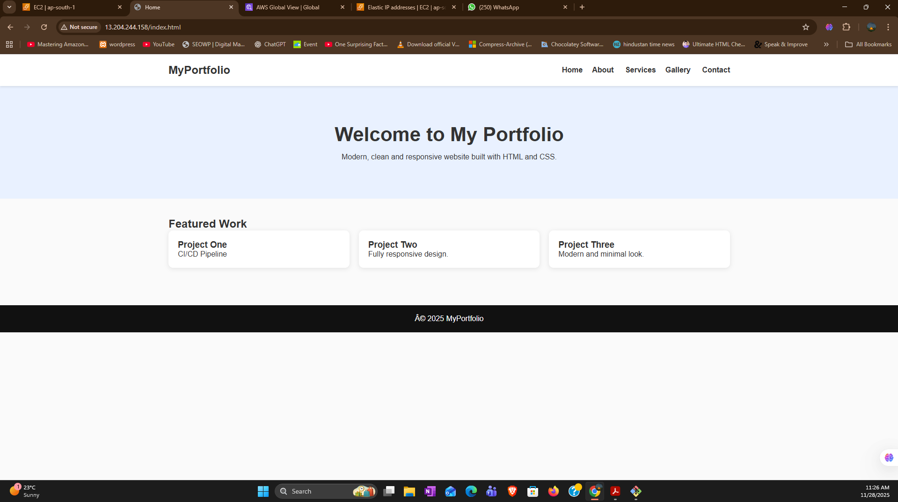

### About Page
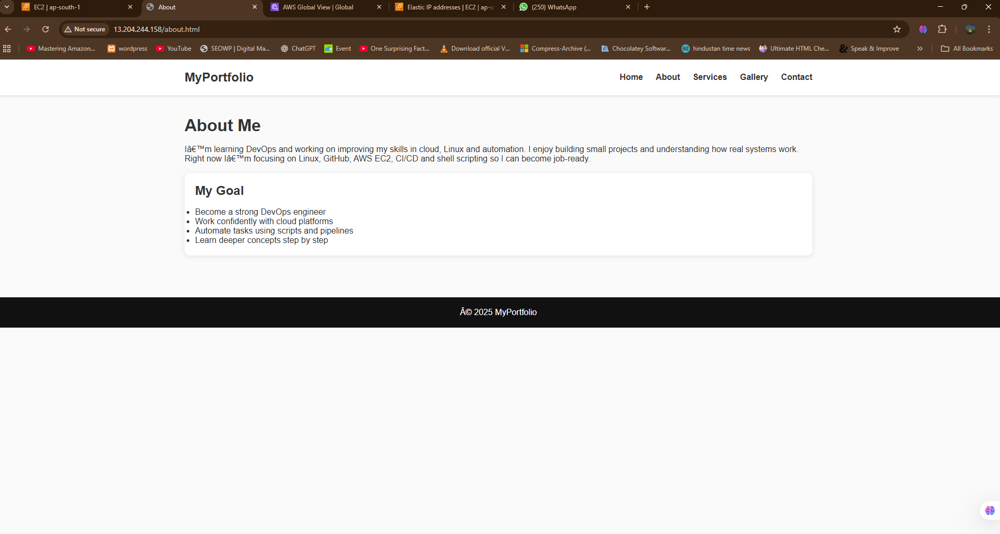

### Services Page
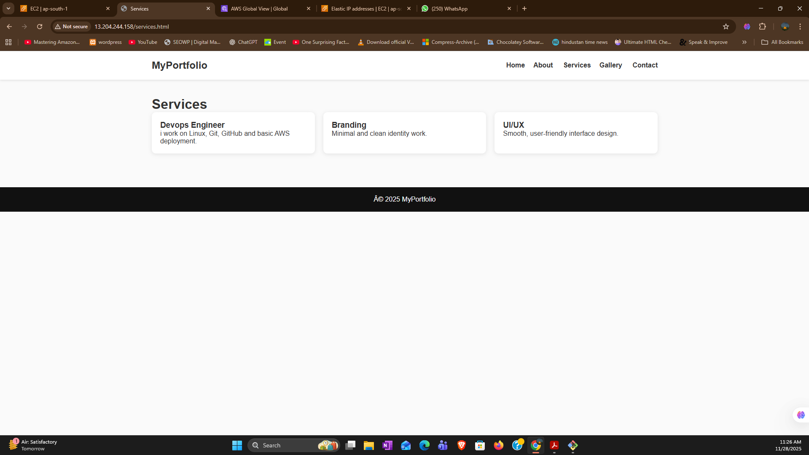

### Gallery Page
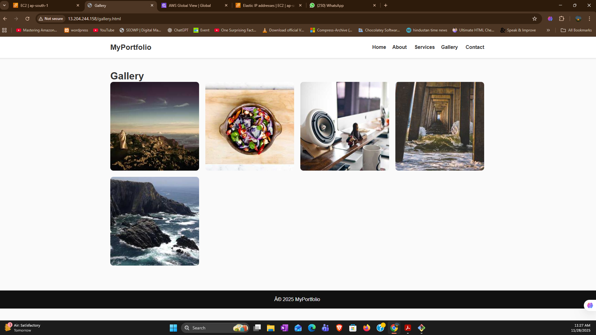

### Contact Page
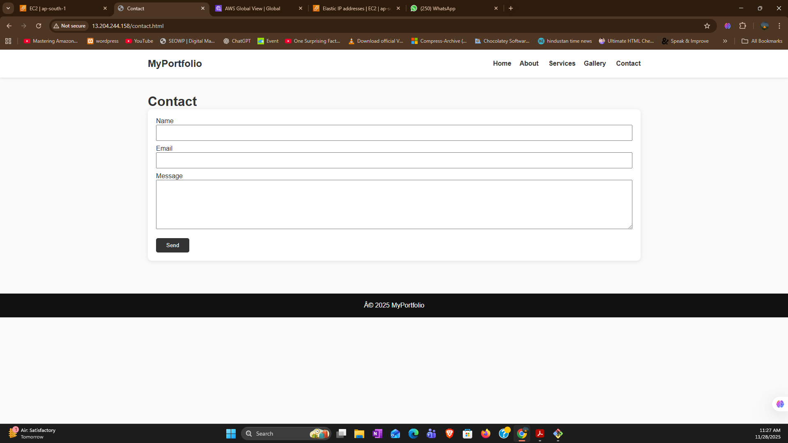

### ec2-dashboard
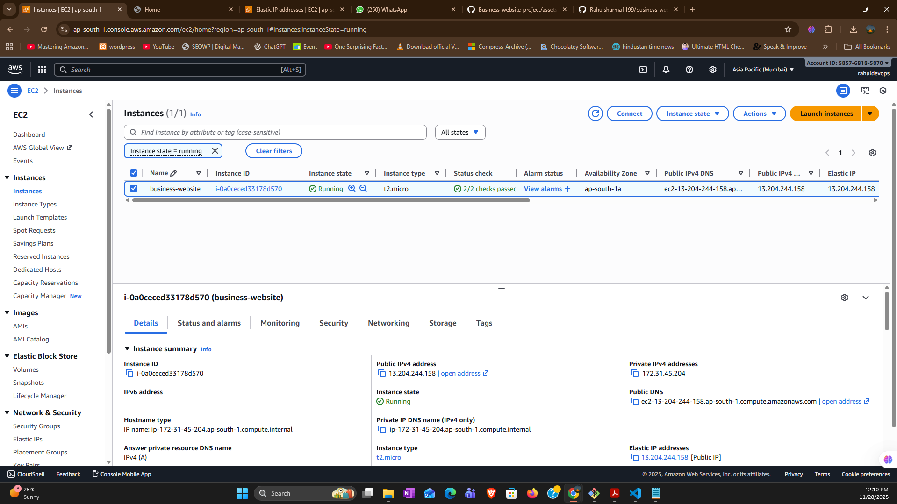

### elastic-ip
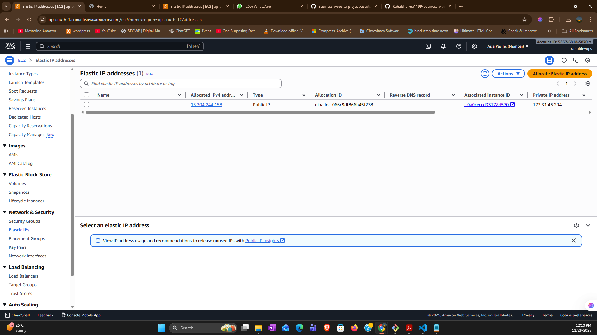

### git-clone-website 
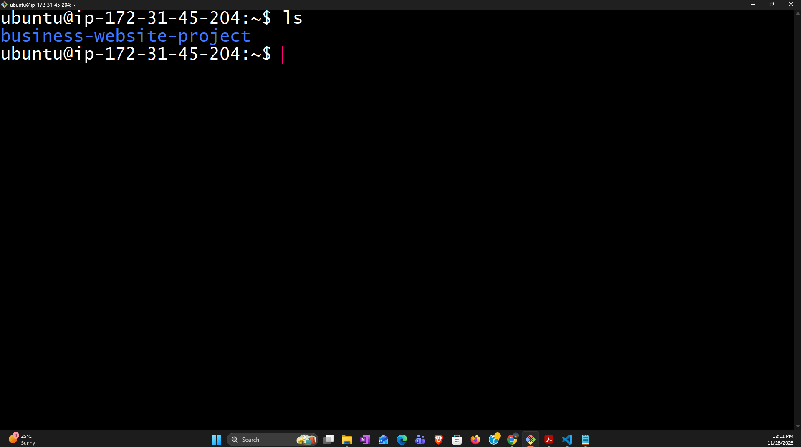

### live-website
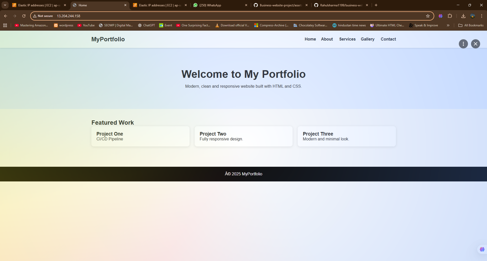

### nginx-status
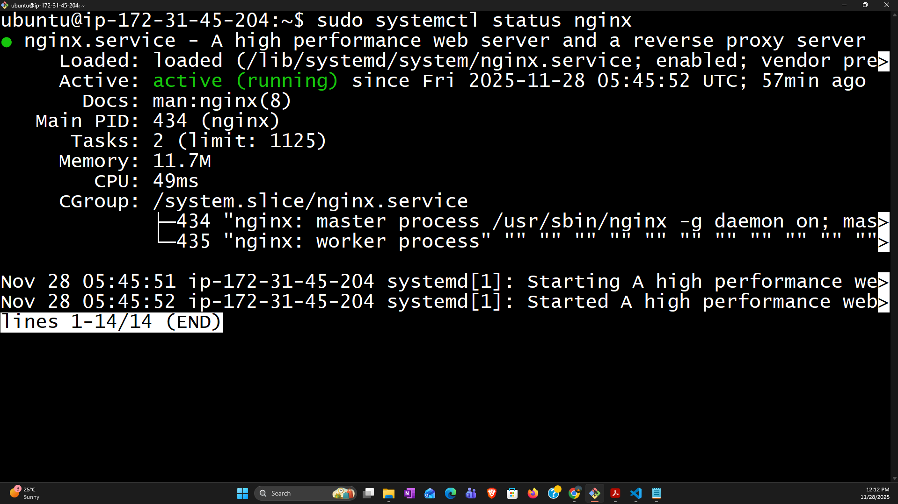

### terminal
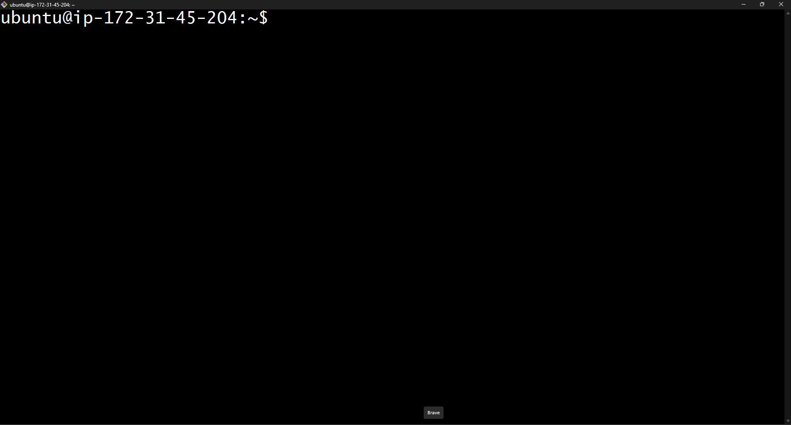

###

Upload your screenshots inside a folder named **screenshots/** in your repository.
